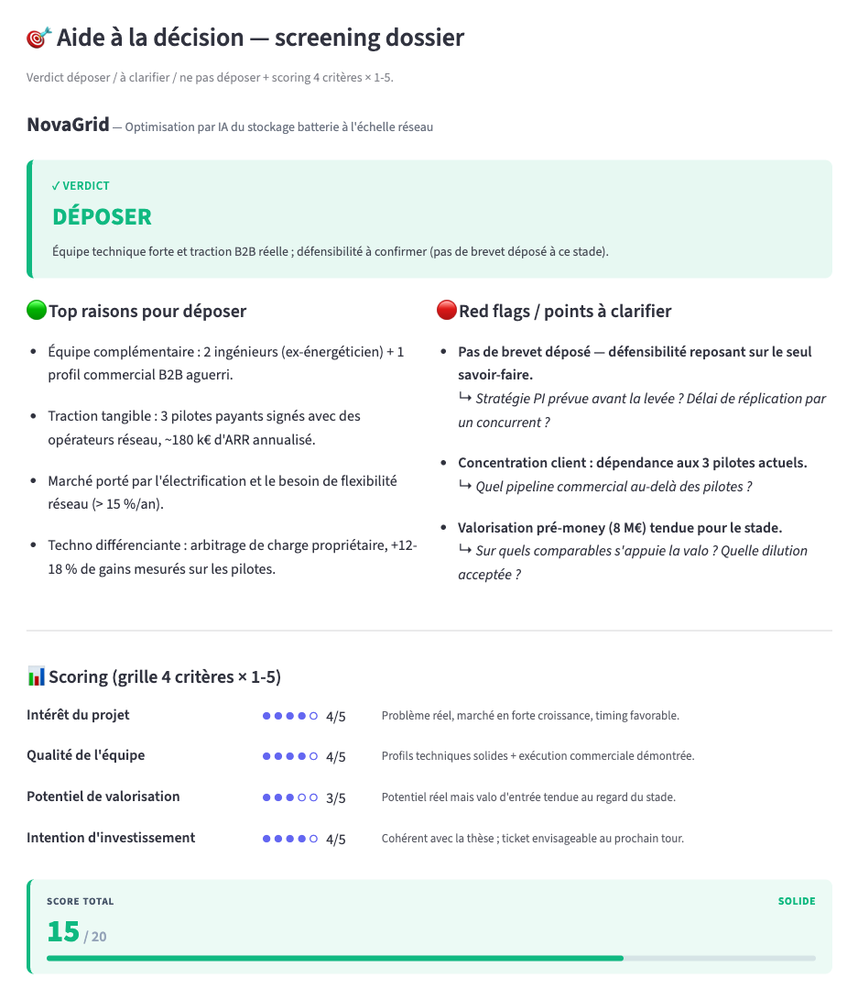
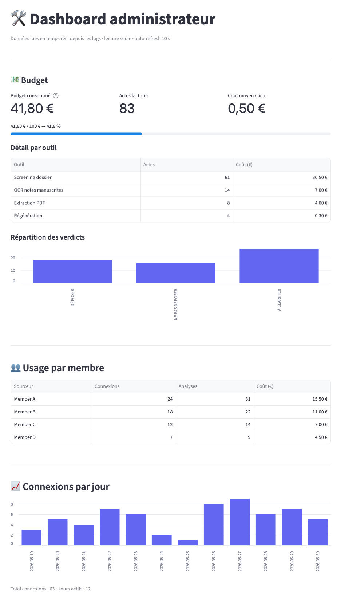
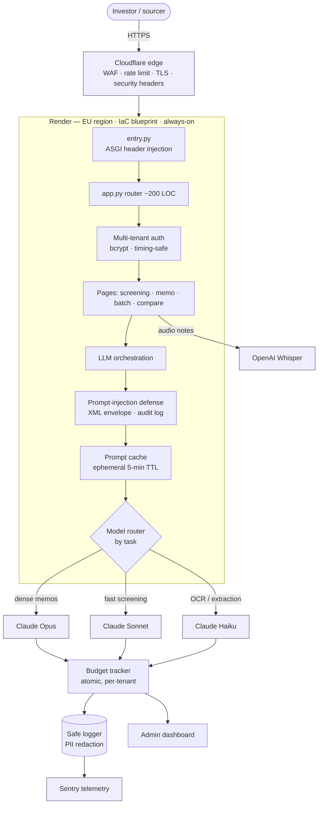

# Deck Analyzer

**An AI decision-support tool that turns a pitch deck + founder-call notes into a structured, defensible investment verdict in under two minutes.** Built for angel networks and VC funds: each tenant gets its own thesis, scoring weights, and pricing, while raw deal data never touches disk.

> Production multi-tenant SaaS (Streamlit + Claude), deployed in the EU. This repository is a **public engineering showcase** — the proprietary prompts, scoring doctrine, and client data live in a private repo and are intentionally excluded.

## Demo

| Screening verdict | Admin / cost dashboard |
|---|---|
|  |  |

_Screens rendered with demo data — no real deal, client, or member._

## Key features

- **Verdict in <2 min, readable in 30 s** — drag a PDF + paste call notes, get a 3-zone verdict (SKIP / LOOK / PASS-ON) on a transparent /20 grid.
- **One product, many investment theses** — each network plugs in its own scoring weights, sector exclusions, and decision thresholds without code changes.
- **Cost-aware by design** — per-task model routing and prompt caching keep the per-analysis cost in cents, tracked live per tenant.
- **Privacy-first** — pitch decks, audio, and notes run in memory only and are purged on logout; logs keep metadata, never content.
- **Two operating modes** — fast upstream screening for sourcers, and full post-call analysis with 4-axis scoring for analysts.

## Architecture

Tenant data is isolated per client **and per member** via namespaced session keys (`client::member::key`) — a second line of defense beyond logout.

## Tech stack

| Layer | Tools |
|---|---|
| **Frontend** | Streamlit (Python SPA), custom CSS/JS |
| **Backend** | Python (CI matrix 3.10 / 3.11 / 3.12) |
| **AI** | Anthropic Claude (Opus / Sonnet / Haiku) with prompt caching · OpenAI Whisper · per-task model router |
| **Infra** | Render (Infrastructure-as-Code, EU region, persistent disk) · Cloudflare (WAF + edge security headers) · Sentry |
| **Security / Auth** | bcrypt · prompt-injection envelope · PII-redacting logger |
| **CI/CD** | GitHub Actions — pytest matrix · ruff lint · Playwright e2e |
| **Other** | reportlab (PDF export) |

## Engineering highlights

- **Multi-tenant isolation, defense-in-depth** — every business-data session key is namespaced `client::member::key`; even a future logout bug can't make tenant A's data reachable from tenant B's namespace.
- **Timing-attack-resistant auth** — password check iterates over *all* tenants so it never leaks how many networks are configured; bcrypt with a constant-time legacy fallback.
- **LLM cost engineering** — task→model routing (Opus/Sonnet/Haiku), ephemeral prompt caching (5-min TTL), and cache-aware cost accounting that prices the three Anthropic billing buckets separately (1.25× create / 0.10× read) so a 90% cache hit shows up as real savings. See [`code-sample/model_router.py`](code-sample/model_router.py).
- **Prompt-injection defense everywhere** — all user input is wrapped in whitelisted XML envelopes with tag-escaping; a constant defense preamble leads every system prompt; injection patterns are audited to a JSONL trail.
- **Privacy by design (GDPR)** — no raw decks/audio/notes persisted to disk (RAM-only, purged on logout/TTL); aggressive PII redaction in logs; EU-only hosting.
- **Production infra as code** — Render blueprint with an explicit data-retention policy on the persistent disk; Cloudflare edge + origin-level security-header injection via an ASGI monkey-patch.
- **Tested and gated** — 1,100+ tests across 42 files, including dedicated suites for prompt injection, session namespacing, data purge, API hardening, and concurrent writes; CI runs them on a 3.10/3.11/3.12 matrix plus Playwright e2e.
- **Clean-architecture refactor** — split a 2,121-line `app.py` monolith into a ~200-line router + a layered `src/` (core / services / ui / infra), behavior-preserving, verified green by the full suite.

## Status

Live in production and deployed in the EU, currently piloting with an angel network. Traction metrics — networks onboarded, decks analyzed, validation-set accuracy — will be published here once measured.

## Contact

[hippolyte.dupac@gmail.com](mailto:hippolyte.dupac@gmail.com)

## License

The showcased product is proprietary. This repository exists to demonstrate engineering practices; the single code sample is a sanitized excerpt published for that purpose.
